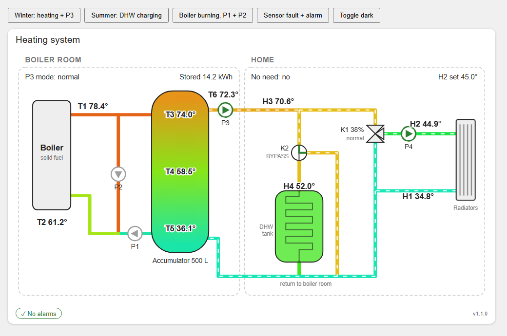

# Heater system — Home Assistant hydraulic diagram card

A Home Assistant dashboard card that draws the whole heating system as a hydraulic diagram:

- **Boiler room:** boiler with T1/T2, the 500 L accumulator coloured by T3/T4/T5, pumps P1, P2 and P3, and T6 on the supply to the home.
- **Home:** H3 hot supply in, K2 diverter (TANK / BYPASS) with the DHW tank and H4, K1 mixing valve (position %, opening/closing), P4 and H2 to the radiators, H1 radiator return.



What it shows:

- **Pipes** are coloured by temperature, from blue (cold) to red (hot).
- **Flow:** a moving dashed line shows where water actually flows right now. This depends on P1/P2/P3/P4 and the K2 position.
- **Pumps** turn green, with a spinning ring, while their relay is ON. A red dashed outline means the state is unavailable.
- **K2** highlights the active leg (TANK or BYPASS).
- **K1** shows its position. While the motor runs it turns orange and shows "▲ opening" or "▼ closing".
- **Badges** at the top show the P3 mode, the stored energy, "No need" and the H2 setpoint.
- **Footer** shows active alarms and warnings as red chips (overheat, fail-safes, B1/B3/B6/H1), or "✓ No alarms".
- **Click** any temperature, pump, valve or badge to open its Home Assistant history/details dialog.
- **Themes:** it follows your Home Assistant theme, light or dark.

It is a single JavaScript file with no dependencies and nothing to build. HACS is not needed.

## Files

| File | Purpose |
|---|---|
| `heater-system-card.js` | The card. This is the only file Home Assistant needs. |
| `example-card.yaml` | Card YAML to paste into a dashboard, with all options commented. |
| `preview.html` | Offline preview with fake data. Open it in a browser to see the card without Home Assistant. |
| `screenshot.png` | Screenshot used in this README. |

## Installation

### 1. Copy the file to Home Assistant

Copy `heater-system-card.js` into Home Assistant's `www` folder, which Home Assistant serves as `/local/`:

```
/config/www/heater-system/heater-system-card.js
```

You can do this with any of these:

- **File editor** or **Studio Code Server** add-on: create the folder `www/heater-system` in `/config` and upload the file.
- **Samba share** add-on: open `\\homeassistant\config\www\` from Windows, create `heater-system`, and copy the file in.
- **SSH / Terminal** add-on: `scp heater-system-card.js root@homeassistant.local:/config/www/heater-system/`.

If the `www` folder did not exist before, **restart Home Assistant once** so it starts serving `/local/`.

### 2. Register the card as a dashboard resource

1. Go to **Settings → Dashboards**, open the **⋮** menu at the top right, and choose **Resources**. If you don't see "Resources", turn on **Advanced mode** in your user profile first.
2. Click **+ Add resource**.
3. **URL:** `/local/heater-system/heater-system-card.js?v=1`
4. **Resource type:** *JavaScript module*
5. Click **Create**.

If your dashboards are in YAML mode, add this to `configuration.yaml` instead:

```yaml
lovelace:
  resources:
    - url: /local/heater-system/heater-system-card.js?v=1
      type: module
```

### 3. Add the card to a dashboard

1. Open the dashboard, click **✏ Edit dashboard**, then **+ Add card**.
2. Scroll down, choose **Manual**, and paste:

   ```yaml
   type: custom:heater-system-card
   ```

3. Click **Save**.

The card is wide. The next section explains how to make it large.

### 4. Hard-refresh the browser

Press **Ctrl+F5** in the browser. In the Home Assistant phone app, go to **Settings → Companion app → Debugging → Reset frontend cache**.

## Making the card bigger

The diagram scales with the width Home Assistant gives the card. In the default **Sections** dashboard a card can never be wider than its section, and sections are narrow. Resizing the card in edit mode therefore stops at the section edge. There are three ways around this. Choose one.

### A. Panel view (biggest, recommended)

The card fills the whole page.

1. **✏ Edit dashboard.**
2. Click the **pencil next to the view (tab) name**, or add a new view with **+**.
3. Set **View type** to **Panel (single card)** and save.
4. Add the card to this view.

Panel view shows only one card. Use a separate view (tab), for example "Heating", for the diagram.

### B. Sections view with a wider section

Recent Home Assistant versions let a section span several columns.

1. **✏ Edit dashboard**, then click the **pencil next to the view name**.
2. Under **Max number of sections wide**, choose 2, 3 or 4.
3. Open the section that holds the card (**⋮ → Edit in YAML** on the section) and add:
   ```yaml
   column_span: 3        # up to the "max sections wide" value above
   ```
4. The card already takes the full section width. You can still drag its right edge in edit mode.

### C. Bigger text only

Increase the size of the labels and the temperatures without changing the card size:

```yaml
type: custom:heater-system-card
text_scale: 1.3     # all labels (0.6 - 1.6, default 1)
temp_scale: 1.4     # temperatures only (default = text_scale)
```

Values up to about **1.3** stay clear of each other. Above that, labels may start to touch pipes on a narrow screen. You can combine this with A or B.

## Checking the entity IDs

The card uses the entity IDs that Home Assistant normally creates from the controllers' MQTT discovery. Examples: device "Boiler room" + "T1 temperature" becomes `sensor.boiler_room_t1_temperature`, and device "Home heating" + "P4" becomes `binary_sensor.home_heating_p4`.

If one of them is different in your installation (for example after a rename), the footer shows an orange chip such as **"2 entities not found: h3, p4"**. Hover over it to see which IDs it looked for. To fix it:

1. Go to **Settings → Devices & services → MQTT → Boiler room / Home heating** and find the real entity ID.
2. Override it in the card YAML:

```yaml
type: custom:heater-system-card
entities:
  h3: sensor.home_heating_h3_temperature_2
  p4: binary_sensor.home_heating_p4_2
```

`example-card.yaml` lists every key with its default ID. The keys `energy`, `p3_mode`, `k1_mode`, `k1_power`, `k1_direction`, `h2_set` and `no_need` are optional. If one of them is missing, that label just shows `--`.

## Options

| Option | Default | Meaning |
|---|---|---|
| `title` | `Heating system` | Card title. Use `""` to hide it. |
| `entities` | see `example-card.yaml` | Override individual entity IDs. |
| `alarms` | overheat, fail-safe alarms, B1/B3/B6/H1 warnings | List of binary sensors shown as red chips while ON. |
| `show_missing` | `true` | Show the "entities not found" hint. |
| `text_scale` | `1` | Size of all labels, 0.6–1.6. |
| `temp_scale` | `text_scale` | Size of the temperatures only, 0.6–1.6. |

## Updating the card

1. Copy the new `heater-system-card.js` over the old one.
2. In **Settings → Dashboards → Resources**, change the URL's version number (`?v=1` → `?v=2`). This makes browsers load the new file.
3. Hard-refresh the browser (**Ctrl+F5**).

The card version is shown at the bottom right of the card and in the browser console.

## How "flowing" is decided

The card animates a pipe when these conditions say water is moving through it. Temperatures colour every pipe all the time.

| Pipes | Animated when |
|---|---|
| Boiler flow → bypass junction, return → boiler | P1 or P2 is ON |
| Bypass junction → accumulator, accumulator bottom → P1 | P1 is ON |
| P2 bypass | P2 is ON |
| Accumulator top → P3 → home, home return → accumulator | P3 is ON |
| K2 → DHW coil → return | P3 is ON and K2 = TANK |
| K2 → bypass → return | P3 is ON and K2 = BYPASS |
| H3 → K1, K1 → P4 → radiators → K1 / return | P4 is ON |

Gravity circulation in the boiler loop (all pumps OFF) is not animated.

## Troubleshooting

- **"Custom element doesn't exist: heater-system-card"**
  - Check that the resource URL opens in the browser (`http://<ha>:8123/local/heater-system/heater-system-card.js`).
  - Check that the resource type is *JavaScript module*.
  - Hard-refresh the browser.
- **The resource URL gives 404:** the file is not in `/config/www/heater-system/`, or Home Assistant was not restarted after `www` was created.
- **All values show `--`:** the controllers are not connected to MQTT, or the entity IDs differ. See the orange chip and "Checking the entity IDs" above.
- **Old version still shows after an update:** increase `?v=` in the resource URL and hard-refresh.
